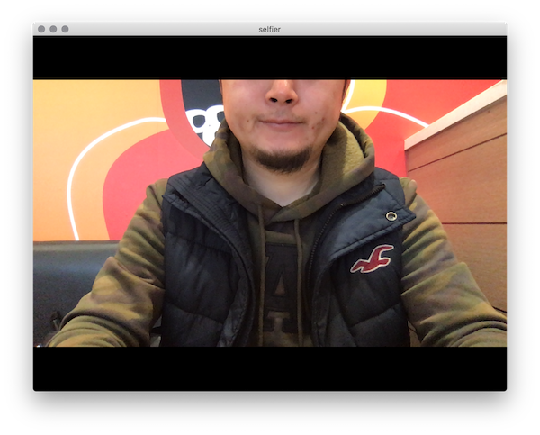

# selfier
An effective tool for live presentations.

## Main Features

 - Access your web camera and display its live view screen.
 - Click the screen to pause the live view.
 - Save paused live views as JPEG files.

## Install And Launch **selfier**

In advance of installing **selfier**, please set up Node.js(v8 or above) and npm environment.

1. Clone or download selfier.

    ```
    $ git clone https://github.com/pokiiio/selfier.git
    ```

1. Install libraries.

    ```
    $ npm install
    ```

1. Launch app.

    ```
    $ npm start
    ```

    or you can build by using following commands.

    ```
    $ npm run build-macOS (for those who love macOS)
    ```

    Building app on Windows and Linux is also supported. Please refer to npm scripts on `package.json`.

## How To Use **selfier**

1. After launching the app, a dialog asking permissions may be displayed. Grant it to use **selfier**.

    

1. This is a main screen. To pause and restart the live view, press `cmd + P` or click the screen.

    

1. To save a paused image, press `cmd + S`.

    